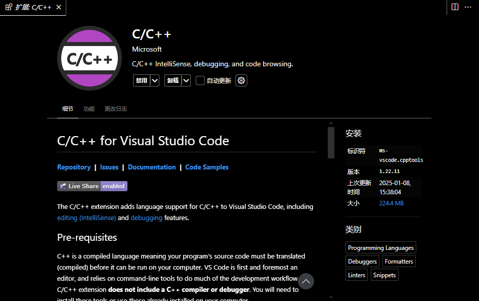
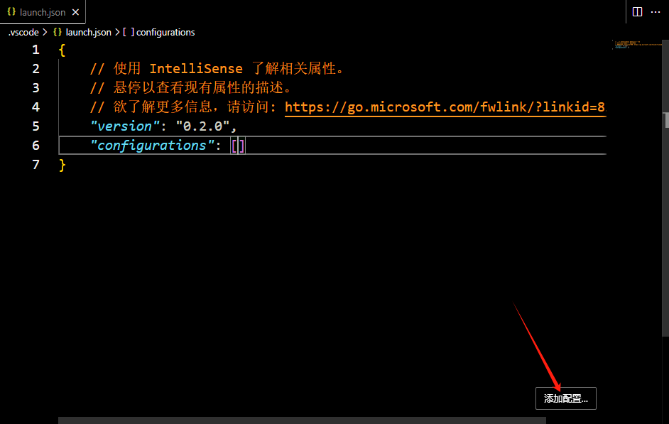
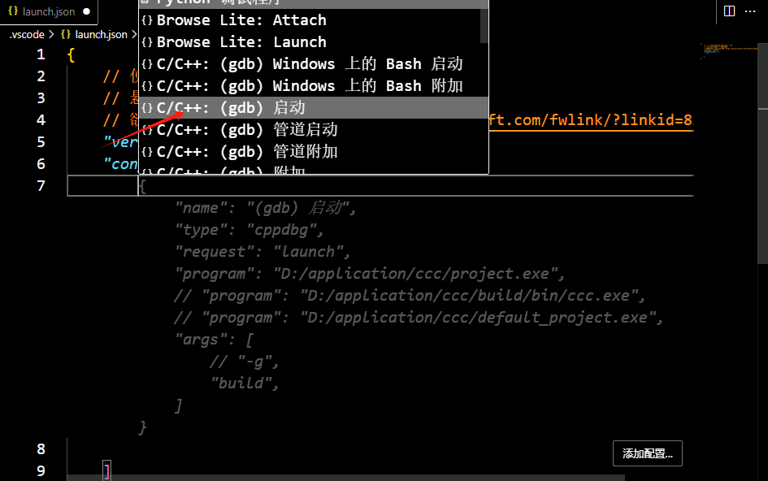
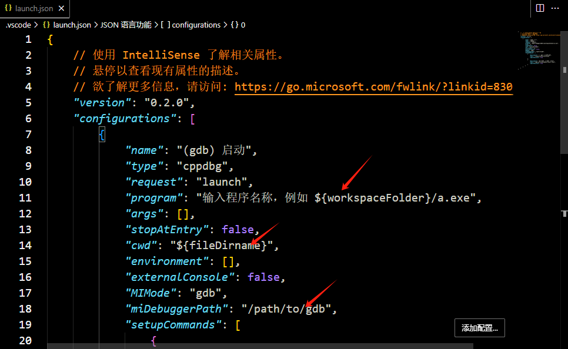
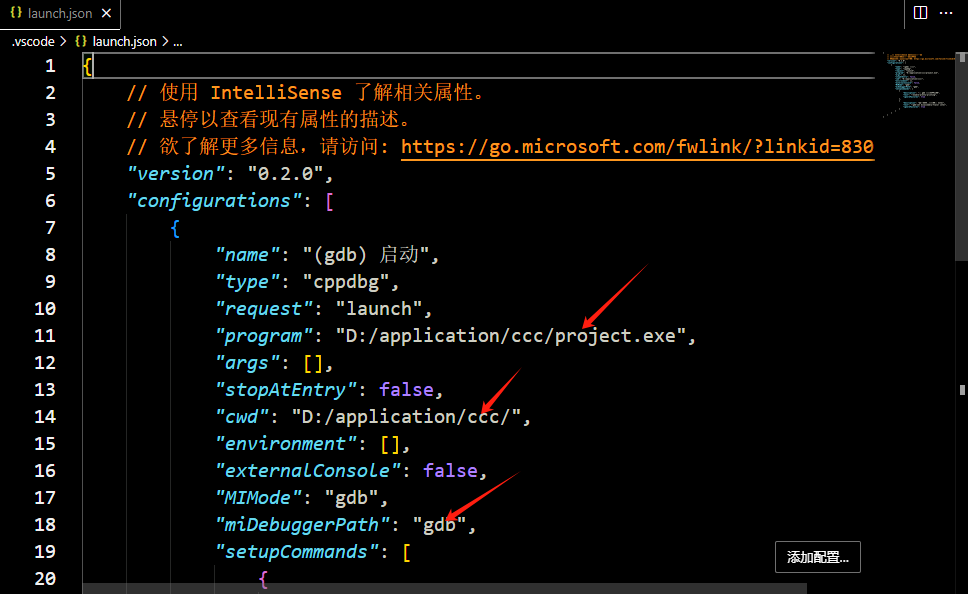
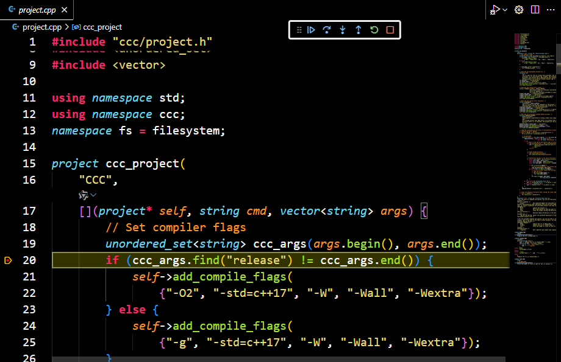

# <div align="center"> ccc </div>

## <div align="center">Directory</div>
- [Project Name](#project-name)
- [Project Introduction](#project-introduction)
- [Install and Uninstall](#install-and-uninstall)
- [Tutorial](#tutorial)

## Project Name
ccc

## Project Introduction
The ccc is a cross platform (currently only supported on Windows and Linux) build tool for C/C++ projects, using C++ as the configuration language for the project.

## Install and Uninstall
#### 1. Download the ccc
```shell
git clone https://github.com/buttfa/ccc.git
cd ccc
```

#### 2. Compile ccc
```shell
make release
# or
ccc release # If you have installed ccc
```

#### 3. Install ccc
```shell
make install
```

#### 4. Uninstall ccc
```shell
make uninstall
```

## Tutorial
#### 0. Get Help about ccc.
```shell
ccc desc CCC
```

#### 1. Execution([Hello world](./example/hello_world/))
##### First, create the src/main.cpp file and write the following content.
```cpp
#include <iostream>
using namespace std;

int main() {
    std::cout << "Hello, World!" << std::endl;
    return 0;
}
```

##### Then create project.cpp in the project root directory to describe project information.
```cpp
#include "ccc/project.h"
#include <string>
#include <vector>
using namespace ccc;
using namespace std;

/* In the init_project function, we can describe and add the libraries and
 * applications that make up the project. */
void init_project(project* self, string cmd, vector<string> args) {
    // Create an application, hello_world is the name of the application.
    execution exe("hello_world", "Say hello world!");
    exe.add_source_files({"./src"}, {".cpp"}); // Add source files
    self->add_task(&exe); // Add the application to the project
}

/* We did not request any resources that need to be manually processed in
 * init_project, so we did nothing in exit_project. */
void exit_project(project* self, string cmd, vector<string> args) {}

/* Register a project and specify its initialization and exit functions. */
project my_project("hello_world", init_project, exit_project,
                   "Say hello world!");
```

##### Finally, run the following command to compile and run the project.
```shell
ccc && ./build/hello_world
```

##### The phenomenon of executing commands is as follows
```shell
$ ccc && ./build/hello_world
g++ -c src\main.cpp -o ./build/obj//src\main.obj   -fdiagnostics-color=always 2>&1
g++ ./build/obj//src\main.obj -o ./build//hello_world  
Hello, World!
```

#### 2. Library([Math library](./example/math_lib/))
##### There are two types of libraries in ccc: static library and dynamic library(or shared_library, which is the same as dynamic library). The type of library is defined as follows(The static library is the default type).
```cpp
enum library_type { static_library, shared_library, dynamic_library };
```

##### Now we put the source file in the 'src' directory and the header file in the 'inc' directory.

##### Then create project.cpp in the project root directory to describe project information.
```cpp
#include "ccc/project.h"
#include <string>
#include <vector>
using namespace std;
using namespace ccc;

void init_project(project* self, string cmd, vector<string> args) {
    /* Create a library, When the suffix of 'name' is not written, ccc will
     * automatically add the prefix and suffix of the library based on the
     * platform. For example, under the Windows operating system, the name of a
     * static library will be changed to lib<name>.lib */
    library mathlib("mymath", library_type::static_library, "My Math Library");

    /* Change to shared library(Default is static library). */
    // mathlib.type = shared_library;

    mathlib.add_source_files({"./src/my_math.cpp"}); // Add source file
    mathlib.add_header_folder_paths({
        "./inc/", // Add header folder path
    });
    self->add_task(&mathlib); // Add library to project
}

void exit_project(project* self, string cmd, vector<string> args) {}

project my_project("Math_Lib", init_project, exit_project, "My Math Project");
```

##### We can run the following command to compile the project.
```shell
ccc
```

##### The phenomenon of executing commands is as follows
```shell
$ ccc
g++ -c ./src/my_math.cpp -o ./build/obj//./src/my_math.obj  -I./inc/ -fdiagnostics-color=always 2>&1
ar rcs ./build//libmymath.lib ./build/obj//./src/my_math.obj
```

#### 3. Dependency([My Math](./example/my_math/))
##### You can consider library and execution as dependencies that can be added to library or execution.
##### We implement the library in math_lib and write the main function in math_exe to verify it.
##### Now I will show you how to describe the dependency relationships involved.
```cpp
#include "ccc/project.h"
#include <string>
#include <vector>
using namespace std;
using namespace ccc;

void init_project(project* self, string cmd, vector<string> args) {
    // Describe the library
    library mathlib("mymath", library_type::static_library, "My Math Library");
    mathlib.add_source_files({"./math_lib/src/my_math.cpp"}); // Add source file
    mathlib.add_header_folder_paths({
        "./math_lib/inc/", // Add header folder path
    });

    // Describe the executable
    execution myexe("myexe", "My Executable to test my math library.");
    myexe.add_source_files({"./math_exe/src/main.cpp"});

    // Add dependency
    // The first true indicates adding the dependency directly to the target,
    // and the second true indicates compiling it if the dependency does not
    // exist.
    myexe.add_dependency(&mathlib, true, true);
    self->add_task(&myexe);
}

void exit_project(project* self, string cmd, vector<string> args) {}

project my_project("Math", init_project, exit_project, "My Math Project");
```

##### We can run the following command to compile and run the project.
```shell
ccc && ./build/myexe
```

##### The phenomenon of executing commands is as follows
```shell
$ ccc && ./build/myexe
g++ -c ./math_lib/src/my_math.cpp -o ./build/obj//./math_lib/src/my_math.obj  -I./math_lib/inc/ -fdiagnostics-color=always 2>&1
ar rcs ./build//libmymath.lib ./build/obj//./math_lib/src/my_math.obj
g++ -c ./math_exe/src/main.cpp -o ./build/obj//./math_exe/src/main.obj  -I./math_lib/inc/ -fdiagnostics-color=always 2>&1
g++ ./build/obj//./math_exe/src/main.obj ./build//libmymath.lib -o ./build//myexe  
1 + 2 = 3
1 - 2 = -1
```

#### 4. Command
##### The commands built into ccc.
- build
    ##### The 'build' command is used to compile the project and its delcaration is as follows.
    ```cpp
    ccc::command build_cmd({"", "build"}, build,
                           "Build the projects based on project.cpp.");
    ```
    ##### This means that the 'ccc' is equal to 'ccc build'.
    ##### This command can not be used in the directory without project.cpp file.
- clean
    ##### The 'clean' command is used to clean the project products and its delcaration is as follows.
    ```cpp
    ccc::command clean_cmd("clean", clean,
                           "Remove products from the projects.");
    ```
    ##### This command can not be used in the directory without project.cpp file.
- describe
    ##### The 'describe' command is used to get the description about something and its delcaration is as follows.
    ```cpp
    ccc::command desc_cmd({"desc", "describe"}, describe,
                          "Get a description of what you want to know.");
    ```
    ##### This means that the 'ccc desc \<name>' is equal to 'ccc describe \<name>'.
    ##### You can get the description of the built-in commands, and get the description of the project, library, execution and custom commands from the project.cpp in the project directory.
- --version
    ##### Use the 'ccc --version' to get the version of ccc.
##### Custom Command
###### You can add your own command to ccc by declaring the command variable in project.cpp.
###### For example, We use 'ccc release' instead of 'ccc build release' by defining the 'release' command in this project.
```cpp
command release_cmd(
    "release",
    [](vector<string> args) {
        cout << "Compile the ccc in release mode." << endl;
        std::string cmd = "ccc build release";
        for (int i = 2; i < args.size(); i++) {
            cmd += " " + args[i];
        }
#ifdef _WIN32
        system(cmd.c_str());
#endif
#ifdef __linux__
        system(("bash -c '" + cmd + "'").c_str());
#endif
    },
    "Compile the ccc in release mode.");
```

#### 5. Debug the executable project file
##### You can debug the executable project file because it also an executable program using c++.
##### We will use vscode to debug the executable project file as an example.
##### 1. Type the following command to generate the debug information in the executable project file.
```shell
ccc project -g
```
##### 2. Ensure that the C/C++plugin is installed.

##### 3. Create a launch.json file in the .vscode directory of the project directory and click the Add Configuration button.

##### 4. Select the C++ (GDB) template.

##### 5. Modify the configuration file.
##### Change 'program' to the executable file generated by the 'ccc project -g' command.
##### Change 'cwd' to the project directory.
##### Change 'miDebuggerPath' to the path of the gdb.
##### If you need, you can set the 'args' parameter to pass parameters to the executable file.


#### 6. Press F5 to debug.

<!--#### 5. Working principle of CCC

#### 6. The classes and commonly used methods provided by ccc-->